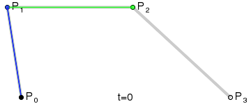
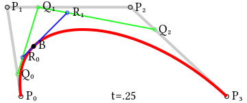

# BezierLaneNet

前段时间读了[PolyLaneNet](https://arxiv.org/abs/2004.10924)的论文，发现论文中的思路跟我当时做的一些工作很类似，感觉手头上的工作可以跟车道线检测这个任务进行结合，于是有了现在的[BezierLaneNet](https://github.com/mo-vic/BezierLaneNet)。但是我自己并不是专门做车道线检测的，所以只花了一个周末的时间，写了一份小代码进行探索性的试验，初步验证了想法的可行性，因此这个模型也只能当作一个基线模型。

**PolyLaneNet**使用了多项式建模车道线，对于每一张输入图片，模型输出$M_{max}$条多项式表示的候选车道线以及地平线的垂直高度$h$，每一条车道线的表示由多项式系数$a_{k, j}$，垂直偏移量$s_j$以及置信度$c_j$构成，其中，区间$[s_j, h]$为多项式的定义域，对于同一张输入图片，地平线的垂直高度$h$是共享的。

**BezierLaneNet**使用了贝塞尔曲线建模车道线，对于每一张输入图片，模型输出$M_{max}$条贝塞尔曲线表示的候选车道线，每一条车道线的表示由贝塞尔曲线的控制点以及置信度$c_j$构成。

**PolyLaneNet** *vs* **BezierLaneNet**：

1. 都直接设定了$M_{max}$的值；
2. 每条车道线都有置信度$c_j$；
3. 贝塞尔曲线的表示方式更加简洁（只需要控制点），其中，第一个控制点和最后一个控制点分别对应了曲线的起点和终点，正好也分别对应了车道线的起点和终点，不需要额外的$s_j$和$h$参数；
4. 若使用贝塞尔曲线标注车道线数据，标记数据可以直接用来训练**BezierLaneNet**;
5. 若使用贝塞尔曲线标注车道线数据，**BeizerLaneNet**可以对数据进行预标记，标注员可以通过调整贝塞尔曲线的控制点进行曲线修正，起到辅助标记的作用。

**贝塞尔曲线背景知识**：

网上有不少介绍贝塞尔曲线的文章，这里不再赘述，只给出维基百科的词条[链接](https://en.wikipedia.org/wiki/B%C3%A9zier_curve)，以及构造一条三次贝塞尔曲线的演示动画图：

动画中$t$的取值范围为$t \in [0, 1]$。值得注意的是，当$t=0.00$时，对应曲线起点$P_0$，当$t=1.00$时，对应曲线终点$P_3$。随着$t$从$0$变化到$1$，从起点到终点的轨迹描绘出一条曲线。对于每一个$t$都有对应的轨迹点与之对应：

<!--more-->

**实验使用的数据集**：

实验使用了[CULane](https://xingangpan.github.io/projects/CULane.html)数据集，该数据集提供了车道线坐标点的标记，很适合用来验证**BezierLaneNet**的可行性。对于数据集中的图片，可能存在$0$条至$4$条车道线，因此，我将$M_{max}$设置为$M_{max} = 4$。对于每一张图片，都有四个数值`0/1`分别表示图片中从左到右四条车道线是否存在，如`0 0 0 0`表示图片中没有车道线，`1 1 1 1`表示图片中有四条车道线，`0 0 1 1`表示图片中有两条车道线。

**BezierLaneNet**模型：

**BezierLaneNet**使用了ResNet101作为主干网络，后接一层全连接层直接回归出贝塞尔曲线的控制点。对于[CULane](https://xingangpan.github.io/projects/CULane.html)数据集，模型固定输出四条贝塞尔曲线`a b c d`，与数据集中的`0/1 0/1 0/1 0/1`标签一一对应，将`0/1 0/1 0/1 0/1`作为每条贝塞尔曲线的置信度$c_j$的标签，以`0/1 0/1 0/1 0/1`逐项乘以四条贝塞尔曲线的回归损失，即可消去`0/1 0/1 0/1 0/1`标签中值为`0`的车道线（即不存在的车道线）的贝塞尔曲线的回归损失。

**训练标签的生成**：

对于模型训练时使用到的标签，可以参考以下两种方式生成：

1. 对[CULane](https://xingangpan.github.io/projects/CULane.html)数据集中的每一条车道线拟合出一条贝塞尔曲线，再将拟合出来的贝塞尔曲线的控制点作为模型回归的目标（两阶段间接法）；
2. 对[CULane](https://xingangpan.github.io/projects/CULane.html)数据集中的每一条车道线，模型直接拟合出一条贝塞尔曲线（一阶段直接法）；
3. 上述两者相结合（既有控制点坐标标签也有曲线坐标标签）。

无论是直接法还是间接法，都需要给数据集中每条车道线的每个坐标点赋予一个$t$值。显然，每条车道线的起点坐标的$t$值为$0.00$，终点坐标的$t$值为$1.00$。对于车道线中的坐标点，有多个方法可以进行赋值，最为简单的一种是计算索引比例：$t = idx / (M-1)$，其中$M$为数据集中一条车道线标记的坐标点的个数，$idx$为车道线标记的坐标点的索引，从`0`开始，故其取值范围为$[0, M-1]$，索引越大，对应的$t$值也越大，并且当索引分别为$0$和$M-1$时，对应的$t$值分别为$0.00$和$1.00$，把起始点和终点的情况也包含在同一条计算公式之中。利用这个方法可以生成比较自然的$t$值，作为对真实$t$值的近似。将$t$值代入贝塞尔曲线的表达式中，通过解方程（伪逆）即可得出控制点坐标作为模型回归目标，也可根据$t$值与模型输出的控制点坐标，直接对车道线标记的坐标点进行拟合。

**模型的训练**：

**BezierLaneNet**的训练采用了一阶段直接法，由于每条车道线的标记坐标点的个数可能不相同，在训练时随机均匀抽取$N$个标记坐标点，并根据$N$个坐标点的索引动态生成对应的$t$值，将模型输出的控制点坐标与对应的$t$值代入贝塞尔曲线的表达式中，得到$N$个预测的坐标点，并在预测的坐标点与标记的坐标点上建立损失函数以提供监督信号。

**最终效果**：



**关于改进的思路**：

1. 预先设置$M_{max}$的值似乎不太合理；

2. `0/1 0/1 0/1 0/1`的标签形式似乎不太合理；

3. 更好的参数$t$的赋值方式；

4. 使用更好的主干网络；

5. ###### ……

