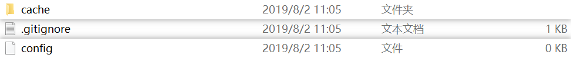

[toc]

<!-- toc -->


# DVC学习笔记

## 1、使用流程

1. DVC的安装：https://dvc.org/doc/install
2. 刚开始使用DVC管理数据需要先做[初始化](#2-dvc初始化)。
3. 如果需要远程存储做备份，需要先[配置](#3-远程dvc存储配置)远程仓库。
4. [添加](#4-添加文件到dvc仓库)文件到DVC仓库，DVC会生成对应的`.dvc`文件，这些文件必须使用Git进行管理；如果同一份数据已经被修改，需要将该文件重新添加到DVC仓库，但是记得在添加后用`dvc gc`进行垃圾回收以减少存储空间的浪费。==注意==：垃圾回收必须配置远程仓库，每个版本的数据必须`push`到远程存储，不然将导致文件丢失。
5. 不推荐手动添加代码生成的数据到DVC仓库，建议使用`dvc run`，见[这里](#7-绑定数据与代码)和[这里](#11-添加指标)。如果正处于调参和Debug等快速迭代阶段，需要使用`dvc run --no-commit`命令，避免DVC将调试中期的文件自动添加到DVC仓库造成存储浪费。当参数或代码调试好了之后，再手动用`dvc commit`命令提交数据文件到DVC仓库。
6. 建议将脚本写成`shell`脚本，这样子命令行参数变化时，`dvc repro`命令可以侦测到变化，从而自动运行复现步骤。另外，`dvc run`命令需要将主脚本（如：`main.py`）的所有依赖（例如所有命令行参数）包含进去。
7. 在调参和调试代码阶段，使用`dvc repro --no-commit`命令，当参数或代码调试好了之后，再手动用`dvc commit`命令提交数据文件到DVC仓库。
8. 配合Git做版本控制。
9. 指标的计算需要在代码中实现，并写入到指定文件中，并将指标文件放入`dvc run`的`-o`参数中。
10. 避免保存无意义的权重文件，否则将浪费大量存储空间。

## 2、DVC初始化

```shell
# 创建Git仓库，用于管理代码和DVC元文件
git init
# 创建DVC仓库，生成DVC元文件和目录文件
dvc init
```

执行上述命令后，当前目录下将会创建如下文件：



```shell
# 将DVC元文件提交至Git的本地仓库
git commit -m "initialize DVC"
```


<!--more-->


## 3、远程DVC存储配置

```shell
# 将远程存储创建在本机上,`-d`表示使用myremote作为默认远程
dvc remote add -d myremote /tmp/dvc-storage
# 将DVC配置文件提交至Git的本地仓库
git commit .dvc/config -m "initialize DVC local remote"

# 配置ssh远程存储
dvc remote add -d myssh ssh://username@xxx.xxx.xxx.xxx:/home/username
dvc remote modify myssh ask_password true
```

其他类型的远程存储配置见：[教程](https://dvc.org/doc/get-started/configure)

## 4、添加文件到DVC仓库

```shell
# 添加`data.xml`文件
dvc add data/data.xml
# 将DVC添加文件时记录信息的`*.dvc`文件和`.gitignore`添加至Git的缓存区
git add data/.gitignore data/data.xml.dvc
# 将DVC添加文件时记录信息的`*.dvc`文件和`.gitignore`提交至Git的本地仓库
git commit -m "add raw data to DVC"
```

总的来说，DVC负责管理文件，Git负责管理文件的版本记录文件。

## 5、提交数据到远程存储

```shell
# 将本地数据仓库备份到远程存储
dvc push
```

==注意==：将数据提交到远程存储后，需要将当前数据状态下的DVC元文件与配置文件提交到Git的本地仓库中，并备份到Git的远程仓库。具体看`git commit`命令和`git push`命令。

## 6、从远程存储取回特定版本的数据

```shell
# 取回当前工作区中所有`.dvc`文件所关联的数据
dvc pull
# 取回当前工作区中特定`*.dvc`文件所关联的数据
dvc pull *.dvc
```

==注意==：从远程存储取回特定版本的数据前，需要从Git仓库中检出特定版本的`.dvc`文件。具体看`git pull`命令和`git checkout`命令。

## 7、绑定数据与代码

```shell
# 使用`dvc run`命令创建流程的一个步骤
dvc run -f prepare.dvc \
          -d src/prepare.py -d data/data.xml \
          -o data/prepared \
          python src/prepare.py data/data.xml
```

==四要素==：

| 参数 |  值   |                             注释                             |
| :--: | :---: | :----------------------------------------------------------: |
|  -f  | *.dvc | 记录文件，记录该步骤的依赖，输出和命令。用于`dvc repro`复现  |
|  -d  |   *   |                 执行该步骤所需的所有依赖文件                 |
|  -o  |   *   |  该步骤执行结束后产生的输出文件，自动添加到DVC的版本控制下   |
| 命令 | 命令  | 任意命令，语言无关。可以是`python`，也可以是`shell`，也可以是其他 |

==注意==：记得将该步骤的记录文件以及相关代码提交到Git仓库。每个单独的实验结束后可以加上一个tag，具体参照`git tag`命令。

## 8、数据流程

流程由多个`dvc run`组建。

## 9、流程可视化

```shell
# 数据流程
dvc pipeline show --ascii train.dvc
# 命令流程
dvc pipeline show --ascii train.dvc --commands
# 输出流程
dvc pipeline show --ascii train.dvc --outs
```

## 10、复现

```shell
# 指定一个记录文件，复现该步骤
dvc repro train.dvc
```

## 11、添加指标

在`dvc run`命令中添加`-M`参数，可以对模型的指标进行跟踪，前提是==需要在代码中加入产生`*.metric`的代码段==。

```shell
dvc run -f evaluate.dvc \
          -d src/evaluate.py -d model.pkl -d data/features \
          -M auc.metric \
          python src/evaluate.py model.pkl \
                 data/features auc.metric
```

## 12、对比不同实验的结果

```shell
# 如果每组实验都有对应的tag，并且都有跟踪的指标，使用`dvc metric show -T`对比实验结果
dvc metric show -T
```

## 13、版本回退

```shell
# 全版本回退
git checkout commit_hash
dvc checkout
# 指定文件版本回退
git checkout commit_hash -- file
dvc checkout
```

## 14、修改默认缓存目录

```shell
# 允许同一个项目的多个成员共用一个缓存目录，
# 减少存储开支
mkdir dvc-cache
dvc config cache.dir /dvc-cache
```

## 15、配置使用链接引用策略

```shell
# 可以组合多个选项
dvc config cache.type hardlink/symlink/copy
# 若`cache.type`配置为`hardlink`或`symlink`，
# 可以使用下述命令将工作区文件设置为只读文件，避免
# 误操作修改了数据
dvc config cache.protected true
```

## 16、更新数据

1. 替换文件

```shell
# `dvc remove`删除工作区文件，缓冲区内文件仍然存在
dvc remove old_file.dvc
touch new_file
dvc add new_file
```

2. 修改文件内容

```shell
dvc unprotect file.dvc
vim file
dvc add file
```

## 17、存在的问题

1. 不支持`glob pattern`；
2. 目前操作系统不支持`reflink`，版本控制用的是复制策略，数据太大时会占用太多的存储空间，同时需要消耗更多的时间。