[toc]

<!-- toc -->


# Latex学习笔记


## Latex文档语法

**教程地址**：https://www.overleaf.com/learn/latex/Learn_LaTeX_in_30_minutes


### class

文档基本元素：

```latex
% 文档类型通过\documentclass{}进行设置
\documentclass{article}

% 文档主体
\begin{document}
\end{document}
```

写论文的话，可以从期刊官网下载模板，在模板的基础上进行修改，添加自己的内容。

### preamble

指的是`\begin{document}`之前的所有内容，用于指定文档字符编码、导入使用的包等等。

```latex
% 12pt是指字体大小，a4paper是指纸张大小
\documentclass[12pt, a4paper]{article}

% 指定文档编码
\usepackage[utf8]{inputenc}
```

### 标题、作者、日期

在[preamble](#preamble)中添加。文章标题不能有下划线。

```latex
\documentclass[12pt, a4paper]{article}
\usepackage[utf8]{inputenc}

\title{Hello World}
\author{movic \thanks{funded by the movic studio}}
\date{April 2020}
```

显示标题信息，在body中添加`\maketitle`：

```latex
\begin{document}
\maketitle
\end{document}
```


<!--more-->


### 添加注释

```latex
% %为注释符号
```

### 粗体、斜体、下划线

```latex
% 粗体
\textbf{}
% 斜体
\textit{}
% 下划线
\underline{}
```

**强调**：使用`\emph`命令的文本会变为斜体，如果原文本已经是斜体，则使用该命令的文本变为正体。

**注意**：有些包如`Beamer`，会改变`\emph`的行为。

### 插入图片

```latex
% 1. 导包
\usepackage{graphicx}

% 2. 指定图片路径
\graphicspath{{images/}}

% 3. 插入图片
\includegraphics{filename}
```

**注意**：图片文件名可加后缀名，也可不加，建议使用小写字母，不能有空格和多个点。

### 图片说明，标签与引用

> *Note: If you are using captions and references on your own computer, you will have to compile the document twice for the references to work.* 

```latex
\begin{figure}[h] % h即here，表示在当前位置插入图片
	\centering % 居中
	\caption{top caption} % 上描述
	\includegraphics[width=0.25\textwidth]{file path}
	\caption{bottom caption} % 下描述
	\label{fig:figname}
\end{figure}

\ref{fig:figname} % 引用图片
```

```latex
% 在twocolumn页面格式中将图片占用两列显示
\begin{figure*}
\end{figure*}
```

### 表格

直接使用TexMaker自带的表格向导就好了。

**`table`与`tabular`的关系**：和`figure`与`\includegraphics`的关系类似，`figure`包含`\includegraphics`，`table`包含`tabular`。`figure`和`table`都可以添加`caption`和`label`。

> *Note: If you are using captions and references on your own computer, you will have to compile the document twice for the references to work.*

### 无序列表

```latex
\begin{itemize}
	\item this is a
	\item this is b
\end{itemize}
```

### 有序列表

```latex
\begin{enumerate}
    \item a
    \item b
    \item c
    \item d
\end{enumerate}
```

### 数学公式

```latex
% inline
$...$

% display
\[...\]
% 不建议使用：
$$...$$

% 带序号
\begin{equation}
\end{equation}
% note: equation环境由amsmath包提供
```


### 基本排版

#### 摘要

```latex
\begin{abstract}
\end{abstract}
```

#### 段落

```latex
% 双回车生成新段落

% 强行换行使用\\，但不建议使用
```

#### 章节和小节

> Note that **`\part`** and **`\chapter`** are only available in *report* and *book* document classes.

```latex
% Numbered section
\section{title}
\subsection{title}
\subsubsection{title}

% Unnumbered section
\section*{title}
```

#### 目录

```latex
\tabelofcontents  % 可放置在\begin{document}的下方
```


## MikTex与TexMaker的安装与使用


### 安装MikTex

**下载链接**：https://mirrors.tuna.tsinghua.edu.cn/CTAN/systems/win32/miktex/setup/windows-x64/basic-miktex-2.9.7386-x64.exe

**Tex教程**：https://texfaq.org/

**Overleaf的Latex教程**：https://www.overleaf.com/learn/latex/Tutorials


### TexMaker的使用

**官网**：https://www.xm1math.net/texmaker/index.html

**下载**：https://www.xm1math.net/texmaker/download.html

**文档**：https://www.xm1math.net/texmaker/doc.html


#### 1. 配置

##### 1.1 配置字符集编码

> Before compiling your first document, you must set the encoding used by the editor ("Configure Texmaker" -> "Editor" -> "Editor Font Encoding"). Then, you should use the same encoding in the preamble of yours TeX documents.

##### 1.2 配置Latex相关命令

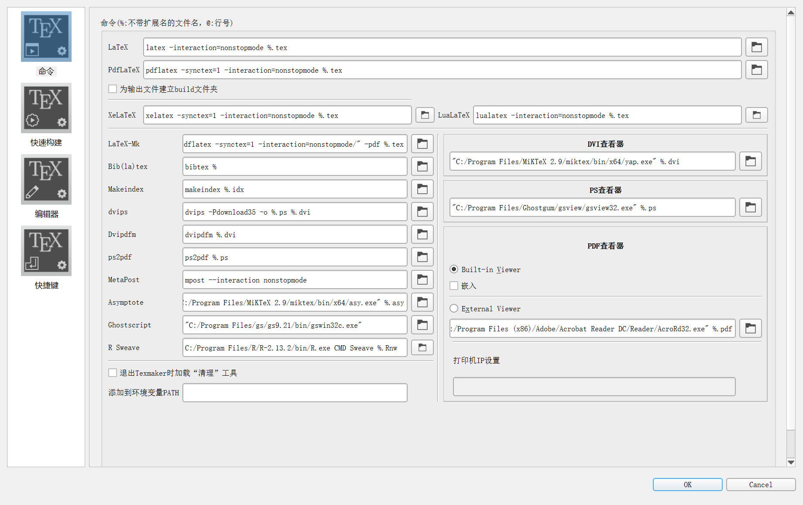

##### 1.3 配置拼写检查

> To configure the spell checker : "Configure Texmaker" -> "Editor" -> "Spelling dictionary" -> click on the button at the end of the line to select the dictionary with the file browser

> During typing, if there is an error, the word is underlined by a red underline. A right-click on the word opens a contextual menu in which there are some replacement suggestions. Click on the desired word to make the replacement

**Tips**： 鼠标右击拼写错误的单词，会有修改提示。

#### 2. 编辑


##### 2.1 快速文档向导

> To define the preamble of your document, you can use the "Quick start" wizard ("Wizard" menu)

##### 2.2 结构化文档


点击该图标添加章节，子章节……

##### 2.3 最多三个书签，单击行号添加

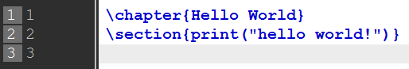


##### 2.4 格式化文本


##### 2.5 空格

**文本**：

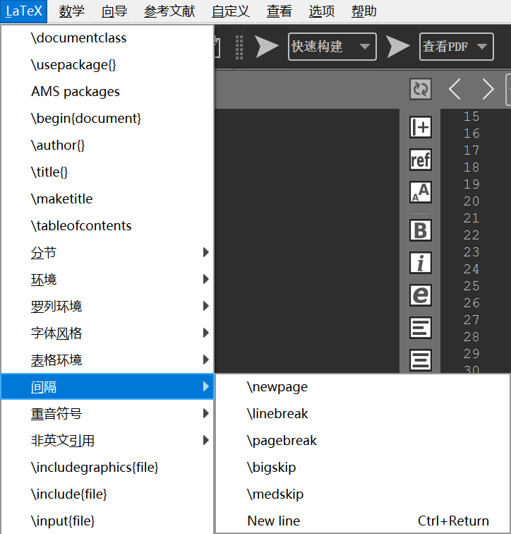

**数学**：

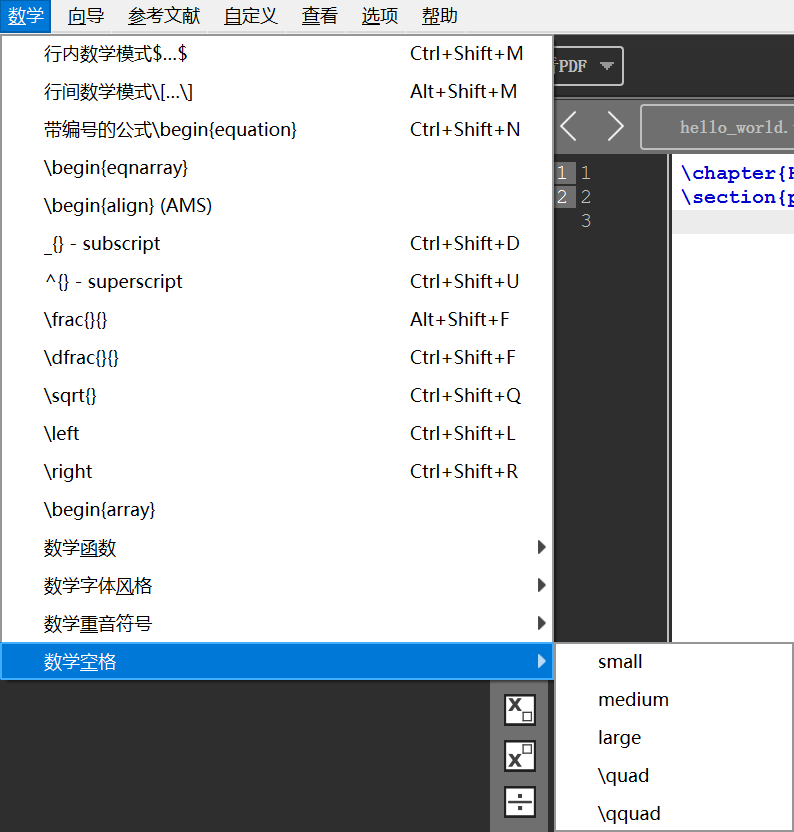

##### 2.6 插入列表

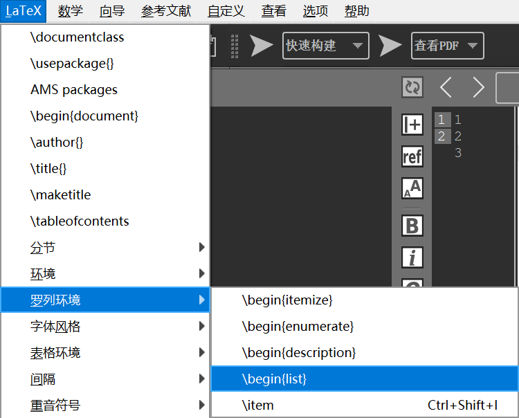

##### 2.7 插入表格

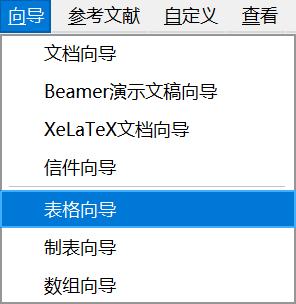

##### 2.8 插入制表符

> To help you to insert a "tabbing" code, you can use the "Tabbing" wizard ("Wizard" menu)

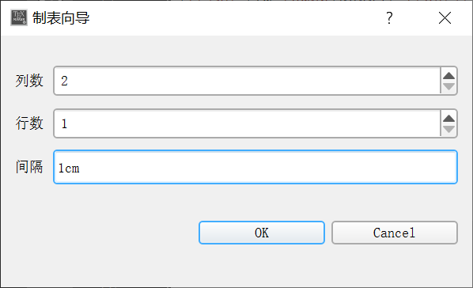

##### 2.9 插入图片

```latex
\usepackage[pdftex]{graphicx}
```

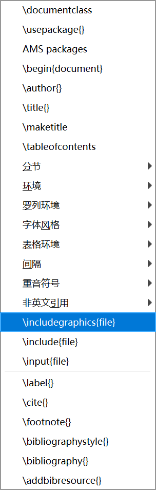

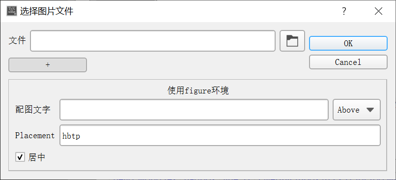

##### 2.10 引用和备注


##### 2.11 常用数学符号


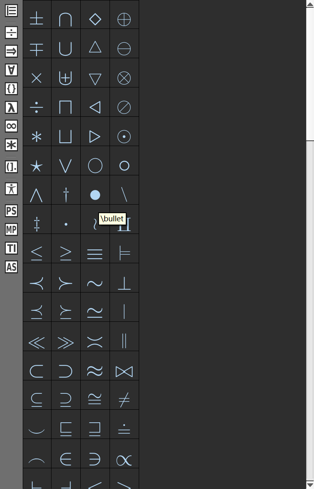

**收藏的符号**：


**右键加入收藏**：


**快速插入数组、矩阵**：

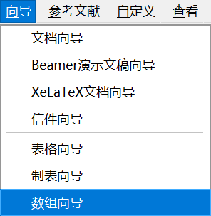

##### 2.12 占位符

**Tip**：使用`Tab`键可以切换字段。


#### 3. 编译文档

##### 3.1 编译


**注意**：必须要有文件名，文件名不能有空格。

##### 3.2 清除生成的中间文件

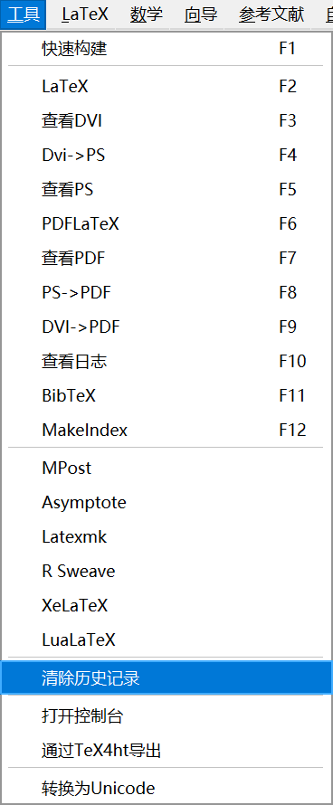

##### 3.3 同步PDF

> If you add the "-synctex=1" option to the pdflatex command, the built-in pdf viewer will jump directly to the position in the PDF file that corresponds to the current line in the (La)TeX source file.
> Reciprocally, with a right-clic on a word in the built-in pdf viewer (context menu), the editor will jump to the corresponding line in the source file.


#### 4. 其他特性

##### 4.1 参考文献

**步骤**：先编译`tex`文件，再用`bibtex`编译`tex`文件，最后再编译`tex`文件。如果因为DOI编译不通过，尝试对下划线进行转义。

>  Note: the optional fields can be automatically deleted with the "Clean" command of the "Bibliography" menu.

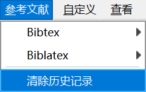

**插入示例**：

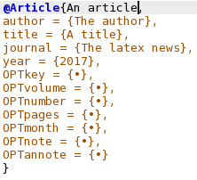

##### 4.2 Source Viewer

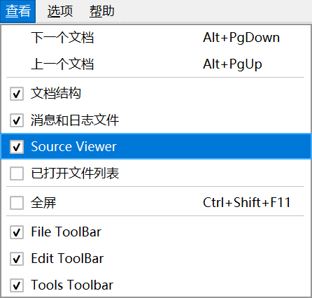

**文档差异对比（挺实用的）**：

**使用方式**：点击左侧图标打开一个对比文件，点击右侧图标查看差异：


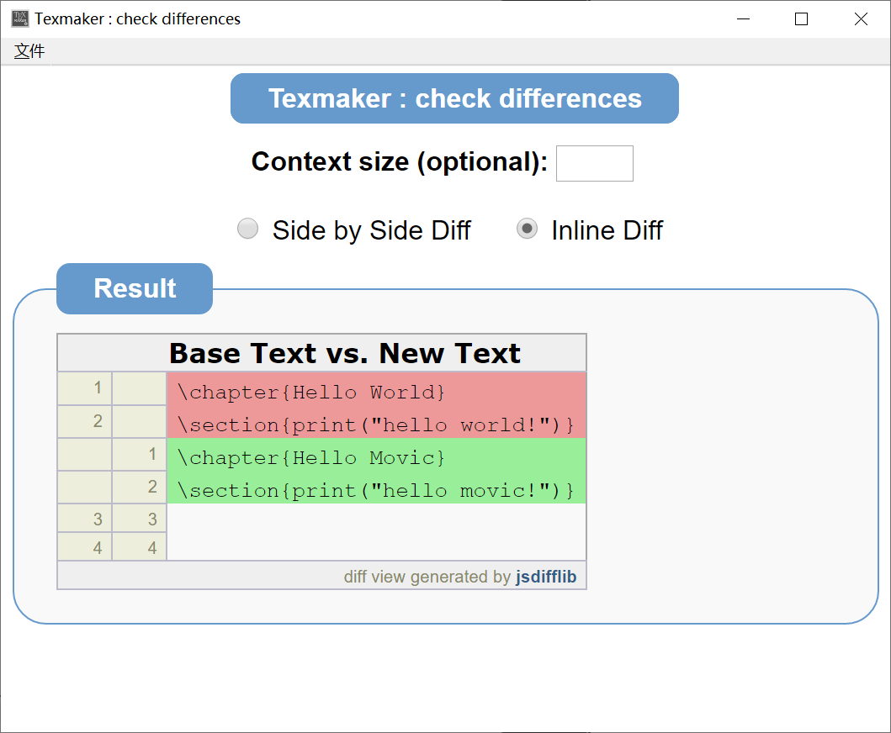


## 第三方差异高亮工具`git-latexdiff`的安装与使用

下载链接：https://gitlab.com/git-latexdiff/git-latexdiff

需要注意的点是：

> **On Windows**
>
> Windows users are likely to be using this tool inside the so-called "Git Bash for Windows" environment which is included in Git for Windows.
>
> In this environment, the provided version of perl might be unable to run `latexdiff`. You can install a different perl distribution, for instance [Strawberry Perl](http://strawberryperl.com). Then, you must put Strawberry Perl's folders before anything else in your `PATH` and run `latexdiff` and `git-latexdiff`.
>
> **Such a change could interfere with the tools in the "Git Bash for Windows" environment, so the `PATH` change should be restricted to uses of `latexdiff`.**

我看不懂Windows安装脚本，里面有关于获取权限的代码，不知是否安全，可以只复制最后一句代码，然后用管理员模式运行。

```
::::::::::::::::::::::::::::
::START
::::::::::::::::::::::::::::

rem Run me as Administrator
set SCRIPT=git-latexdiff
for /f "delims=" %%i in ('git --exec-path') do copy /Y %~dp0\%SCRIPT% "%%i\%SCRIPT%"
pause 0
```

如果使用`Git`的过程中发现出现异常，则把Perl的环境变量移动到最底下。


**git-latexdiff**使用的注意事项：

1. `git-latexdiff`不需要提供两份（新旧）对比的工程文件，只需要指定Git的版本标签，使得可以跟Git无缝衔接；
2. 记得指定输出临时目录`--tmpdirprefix`，不然输出结果很难找；
3. `--cleanup`设置为`none`，用于保留输出结果；
4. 指定`-b`参数可以顺带走完文献引用流程；
5. 标准命令：

```
git latexdiff HEAD -- --main bare_jrnl.tex -b --cleanup none --tmpdirprefix ./latexdiff
```

5. 表格`multirow`使用习惯从`\multirow{5}*`改为`\multirow{5}{*}`

